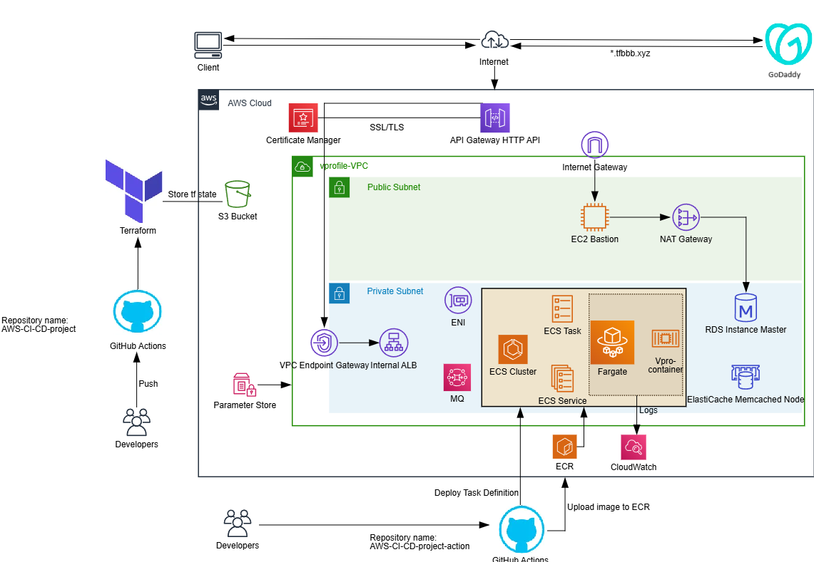

# AWS-CI-CD-project

This is my DevOps project, implemented as a Blog web application to represent my ability to build and automate an entire CI/CD process. The project is separated into two GitHub repositories to make it more easy to work with by different teams and also to make it more readable and easy to track the versions of deployments separately. 

The repository named AWS-CI-CD-project contains Infrastructure as code in AWS using an IAC tool Terraform. It is automated in a workflow using GitHub Actions. The workflow creates a container with Ubuntu image in which in further steps checks for the source code, sets up Terraform, afterwards initializes the terraform code in the specified folder, checks if it is properly formatted, validates it, prepares a plan with an output, displays the output and if it is a success and the code is run in the main branch, applies it to AWS.

Link for the repository: https://github.com/TolgaBeyzatov/AWS-CI-CD-project/tree/stage

Second repository which includes Github Actions workflow for the CI/CD process performs the following steps:
- First job is testing:
- Tests if the code can be accessed by the workflow;
- Ensures that the source code is compiled before tests are run. "mvn test" offers immediate feedback on the internal logic of the code. This step is crucial for identifying and addressing issues promptly, significantly reducing bugs and enhancing code quality. This is an integral part of the CI proccess as it is a proactive approach to maintain a robust and efficient codebase.
- Performs a checkstyle analysis to check if the code adheres to Java code quality standards and identifies potential issues. Enforces coding standards across the teams, identifies style violations before merging code.
- Next step in the CI process is SonarQube analysis to analyze code and identify potential issues like bugs, vulnerabilities and code smells. It operates on the code that has been checked out from the VCS, generates an anlysis report and sends it to the SonarCloud server.
- Last step before building and publishing the code to the ECR is the Quality gate status. It acts as a checkpoint in the CI/CD pipeline, ensuring code quality based on specific metrics and tresholds. There is a predefined threshold of conditions that the project's code must meet before it can be considered for release in the main branch.

- Next job is Build and Publish. It checks the code, configures the AWS access credentials which are stored securely in Github Secrets, gets the RDS, RabbitMq, and Elasticache endpoint values from the AWS Parameter Store and updates the application.properties file. The last step is to build and upload the image to ECR with the multistage Dockerfile located in the repository.

- The last job includes updating the new image ID and deploying the new parameters and number of containers in a task definition file ECS Service.

Link for the repository: https://github.com/TolgaBeyzatov/AWS-CI-CD-project-action/tree/stage

Tools and services used in the project:
- Terraform - is used as IaC tool for creation and deploying the AWS infrastructure where the application is deployed. It enhances the automation, consistency, version controlling, collaboration and cost saving.
- Git - used as the version control system which GitHub uses.
- GitHub - Used as a repository so the project can be stored, shared and tracked and managed changes. 
- GitHub Actions - The project is automated using GitHub Actions workflows. 
- SonarQube Cloud - SonarQube analyzes the source code, looking for potential issues like bugs, vulnerabilities and code smells. It generates detailed reports and visualizations of code quality metrics. after successful integration you can check the results in https://sonarcloud.io. This project also uses Quality Gates which can be defined in advance for certain level of percentage to pas. If the required level is exceeded the CI fails.
- Docker - Docker is used for building the application and creating an image which is deployed in ECR. The Dockerfile is located in AWS-CI-CD-project-action repository. The application also runs in a ECS container.
- Maven - Maven is used to ensure all the necessary components are automatically fetched and integrated into the project. It executes tests which is a crucial step in maintaining code quality. In the end it packages the Java application efficently in "war" file which is used afterwards in the deployment of the new application version in the ECS containers.
- ECS - An ECS container contains the Apache Tomcat application after being defined by Task definition. The task definition file is defined in Terraform since this approach provides version control, reproducability and consistency across environments. Other benefits for using this approach can be pointed as Automation and Simplified Management - managing ECS task definitions alongside other infrastructure resources (like clusters, services, etc.) within the same Terraform configuration. 
A lifecycle rule for ignoring changes is used in the defining of the service to prevent Terraform from updating the task definition on every apply as a new task definition with container definition is being deployed on each new version of the application.
- ECR - The workflow builds an image with the latest tag and version number from a multistage Dockerfile located in the AWS-CI-CD-project-action repository. After the built is done it pushes the image to the AWS ECR.
- EC2 - In this project an EC2 instance is used as a Bastion host which role is to deploy the database schema. It uses a script located in the AWS-CI-CD-project GitHub repository /terraform/templates/db-deploy.tmpl.
- S3 - The object storage service is used as a backend for storing the state in a remote service. Accessing remote state requires access credentials which are stored as Secrets in GitHub, since state data contains extremely sensitive information. It also allows multiple teams to access it. 
- API Gateway - The project uses API Gateway since it acts as a mediator between clients and backend services, manages traffic and enforces security. 
  The API Gateway configuration includes the following steps:
  - Creating VPC Link configured with the private subnets;
  - Creating the API Gateway HTTP endpoint;
  - Creating the API Gateway HTTP_PROXY integration between the     created API and the private ALB via the VPC Link;
  - API GW route with ANY method. In general Routes direct incoming API requests to backend resources. For the project it is used "ANY" method to match all the methods which are haven't defined for the resource. It is used $default route that acts as a catch-all for requests that don't match any other routes. When the $default route receives a request, API Gateway sends the full request path to the integration. ("https://docs.aws.amazon.com/apigateway/latest/developerguide/http-api-develop-routes.html#:~:text=When%20a%20client%20sends%20an,does%20not%20generate%20CloudWatch%20logs.")
  A so called "greedy path variable" is used as {proxy+} which catches all child resources of a route.
  - Set a default stage aws_apigatewayv2_domain_name - In this step a custom domain name which is created in GoDaddy is associated and configured with an ACM certificate, endpoint type and security policy; The default stage is mapped to the domain name (*.tfbbb.xyz).
 
  The end user connects to the application via https connectivity using the abovementioned GoDaddy domain address https://cvapp.tfbbb.xyz.
- Parameter Store - Used to safely maintain by Terraform and get by the CI/CD workflow endpoints for the services used in the app.
- IAM - Used to manage the IAC and CI/CD users and policies needed to run the infrastructure, tests and deployments smoothly and securely.
- VPC - A VPC is initiated in the IAC to create an isolated private cloud with custom subnets, security groups and services.
- ALB - An Application load balancer is used to safely connect The ECS containers in the Private subnets, to load balance the traffic (In this project there is only one container for the sake of economies and simplicity but they can easily scaled) and also to maintain sticky sessions when there are more than one containers. 
- VPC Link resource - Allows connecting API routes within VPC. It uses interface endpoints to securely expose private VPC resources to API Gateway without exposing them to the public internet. This ensures traffic remains within the AWS network. Such as in this project it connects the Application load Balancer which operates in private subnet, without exposing to the public internet. The benefits of using it are: 
  Enhanced security - reducing the attack surface;
  Private Access - Allows access to resources that are not publicly accessible;
  Simplified Architecture - eliminates the need for public IPs, Internet Gateways or VPNs for internal communication.
- RDS MySQL - The application uses RDS as its database, it is created during the Terraform apply process, its endpoint is exported to AWS Parameter Store and integrated in the Application.properties file with "sed" script in the CI/CD workflow before building the war. The database schema is deployed with a Bastion host.
- RabbitMQ - The application connects to the RabbitMQ service the same way it connects to RDS. The choice of this service and not sqs  as a message broker is for simpler integration with the app.
- Elasticache Memcached - For simplicity and cost efficiency, the Elasticache cluster contains only one node in the cluster. It is deployed in a private subnet. The connection with the endpoint is same as with the previous two services. This project is still ongoing and I am still working on the implementation of Memcached with the application. It is going to help caching the results of database calls. 

Diagram for a visual representation of the cloud architecture of my project:

Screenshots of the application:

